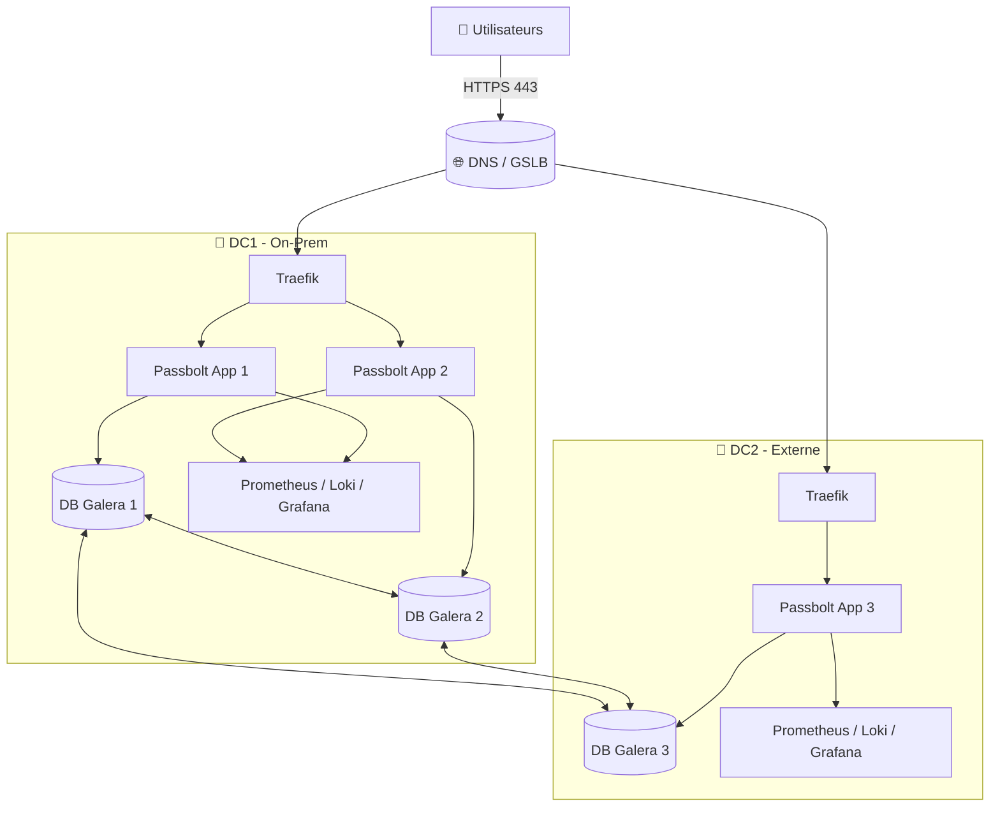

# 🧑‍🚒🔐 Passbolt HA – Docker – 2 Datacenters – 2000 utilisateurs

> **Contexte critique** : gestion sécurisée des secrets pour une **caserne de pompiers** (~2000 agents).  
> **Exigences** : haute disponibilité, sécurité maximale, continuité de service, traçabilité complète.

## 🎨 Légende pastel

- 🟦 Architecture & Infra
- 🟩 Déploiement & Run
- 🟨 Sécurité
- 🟪 Observabilité & Incidents

---

## 🎯 Objectifs du projet

- 🔐 Gestion des mots de passe avec **Passbolt CE**
- ⚙️ Déploiement **Docker**
- 🏢 **2 Datacenters** (on-prem + externe)
- ♻️ Haute disponibilité (apps + base)
- 🚨 Supervision, alerting, incidents centralisés
- 🔄 Mises à jour **automatisées mais contrôlées**
- 📜 Journalisation complète (audit / forensic)

---

## 🧩 Stack technique (versions épinglées)

| Composant | Image Docker | Version | Rôle |
| --- | --- | --- | --- |
| Passbolt CE | `passbolt/passbolt` | `5.9.0-1-ce-non-root` | Application |
| Reverse Proxy | `traefik` | `v3.6.7` | TLS / LB |
| Base de données | MariaDB Galera | Cluster 3 nœuds | Quorum HA |
| Metrics | `prom/prometheus` | `3.5.1` | Supervision |
| Logs | `grafana/loki` | `3.6.1` | Centralisation logs |
| Dashboards | `grafana/grafana` | `12.0.9` | Visualisation |
| Incidents | `grafana/oncall` | `v1.16.9` | Astreinte |

⚠️ **Jamais de `latest` en production**

---

## 🗂️ Arborescence du dépôt

```text
passbolt-ha/
├── README.md
├── compose/
│   ├── dc1/
│   │   ├── reverse-proxy.compose.yml
│   │   ├── passbolt-app.compose.yml
│   │   ├── db-galera.compose.yml
│   │   └── observability.compose.yml
│   └── dc2/
│       ├── reverse-proxy.compose.yml
│       ├── passbolt-app.compose.yml
│       ├── db-galera.compose.yml
│       └── observability.compose.yml
├── env/
│   ├── dc1.env.example
│   └── dc2.env.example
├── secrets/        # jamais commit
│   ├── db_password.txt
│   ├── smtp_password.txt
│   └── jwt_secret.txt
├── volumes/
│   ├── passbolt/
│   │   ├── gpg_volume/
│   │   └── jwt_volume/
│   └── db/
│       └── data/
└── runbooks/
    ├── incident_app.md
    ├── incident_db.md
    ├── incident_dc.md
    ├── backup_restore.md
    └── upgrade.md
```

---

## 🏗️ Architecture globale (Mermaid)



---

## 🔁 Matrice des flux réseau

| Source | Destination | Port | Description |
| --- | --- | --- | --- |
| Users | Traefik | 443 | Accès HTTPS |
| Traefik | Passbolt | 8080 | HTTP interne |
| Passbolt | MariaDB | 3306 | DB privée |
| MariaDB | MariaDB | 4567/4568 | Réplication Galera |
| Passbolt | SMTP | 587 | Envoi mails |
| Services | Loki | 3100 | Logs |
| Services | Prometheus | 9090 | Metrics |
| Alertmanager | OnCall | Webhook | Incident |

---

## 🧩 Docker Compose – Passbolt (extrait)

```yaml
services:
  passbolt:
    image: passbolt/passbolt:5.9.0-1-ce-non-root
    restart: always
    ports:
      - "8080:8080"
    environment:
      APP_FULL_BASE_URL: https://passbolt.example.org
      DATASOURCES_DEFAULT_HOST: db-vip.internal
      DATASOURCES_DEFAULT_DATABASE: passbolt
      DATASOURCES_DEFAULT_USERNAME: passbolt
      DATASOURCES_DEFAULT_PASSWORD_FILE: /run/secrets/db_password
    secrets:
      - db_password
    volumes:
      - /opt/passbolt/gpg_volume:/etc/passbolt/gpg
      - /opt/passbolt/jwt_volume:/etc/passbolt/jwt
```

---

## 🟩 Procédures de remédiation

### 🔧 Panne d’un nœud applicatif

```bash
docker logs passbolt
docker restart passbolt
```

### 🗄️ Panne d’un nœud DB

- Vérifier le quorum Galera.
- Réintégrer le nœud après correction réseau/disque.

### 🏬 Panne complète d’un DC

- DNS bascule vers l’autre DC.
- Vérifier le quorum DB.
- Si besoin : restauration depuis backup chiffré.

---

## 🔄 Plan de mise à jour & maintien en condition opérationnelle

### Automatisation contrôlée

| Besoin | Outil |
| --- | --- |
| PR automatiques | Renovate |
| CI/CD | GitHub Actions |
| Scan CVE | Trivy |
| Signature images | Cosign |
| Déploiement | Argo CD (GitOps) |
| Logs & Metrics | Grafana Stack |
| Incidents | Grafana OnCall |

### Cycle de mise à jour

1. Renovate ouvre une PR.
2. CI : lint + scan + tests.
3. Validation humaine.
4. Déploiement progressif (rolling update).
5. Supervision & rollback auto.

---

## 🟪 Observabilité & incidents

- 📊 Dashboards Grafana (infra, app, DB)
- 📜 Logs centralisés Loki
- 🚨 Alertes Prometheus
- ☎️ Astreinte via Grafana OnCall
- 🧾 Post-mortem documenté

---

## 🔐 Sécurité (checklist)

- TLS partout (HSTS, TLS 1.2/1.3)
- DB jamais exposée
- Secrets hors repo
- Sauvegardes chiffrées & testées
- Journalisation centralisée
- Principe du moindre privilège

---

## ✅ Definition of Done (DoD)

- 2 DC opérationnels
- Quorum DB valide
- HA applicative fonctionnelle
- Backups restaurables
- Supervision & alerting actifs
- Runbooks testés
- Mises à jour automatisées
